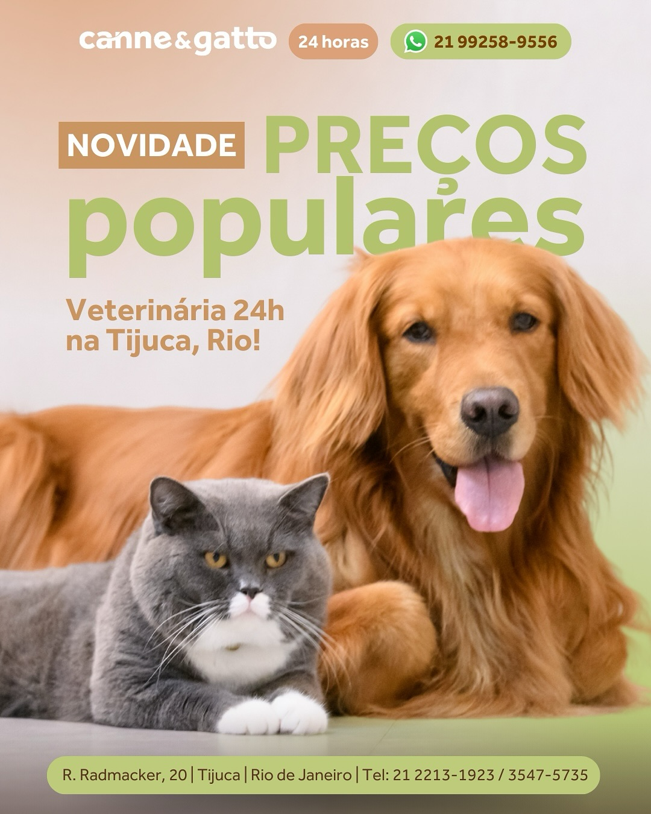

# 🏥 Canne & Gatto | Hospital Veterinário 24h

Uma landing page premium, moderna e de alta conversão para o **Hospital Veterinário Canne & Gatto**, localizado na Tijuca, Rio de Janeiro. Este projeto destaca a autoridade médica, tecnologia de ponta e o cuidado humanizado com pets.



## 🚀 Funcionalidades Principais

- **Atendimento 24h**: Destaque para urgência e emergência na Tijuca.
- **Especialidades Médicas**: Grid detalhada de serviços especializados.
- **Exames de Imagem**: Foco na tecnologia **Versana Active VET**.
- **Centro de Capacitação**: Seção dedicada a cursos e formação de profissionais.
- **Localização Inteligente**: Google Maps interativo no rodapé.
- **Identidade Visual Premium**: Branding consistente com o ampersand (&) verde e tipografia `Outfit`.

## 🛠️ Tecnologias Utilizadas

- **Vite**: Build tool ultrarrápido.
- **React**: Biblioteca para interfaces reativas.
- **Vanilla CSS**: Estilização pura pautada em variáveis globais (`index.css`).
- **Google Fonts**: Integração com a família `Outfit`.

## 📦 Como Executar o Projeto

1. **Instalar dependências**:
   ```bash
   npm install
   ```

2. **Rodar em desenvolvimento**:
   ```bash
   npm run dev
   ```

3. **Gerar Build de Produção**:
   ```bash
   npm run build
   ```

## ⚙️ Configuração de Deploy

Este projeto está configurado para rodar em um subdiretório:
- O arquivo `vite.config.js` possui o `base: '/canneegatto/'`.
- Certifique-se de que o servidor de hospedagem aponte para esta pasta raiz.

## 🧠 Inteligência do Projeto (SKILL.md)

Para desenvolvedores ou assistentes de IA que desejam entender as regras de design, tokens de cores e padrões arquiteturais do código, consulte o arquivo [**SKILL.md**](./SKILL.md).

## 👩‍⚕️ Equipe Técnica
- **Direção Técnica**: Dra. Adriene Firmo (CRMV RJ 5302).

---
© 2026 Canne & Gatto Veterinária Ltda.
